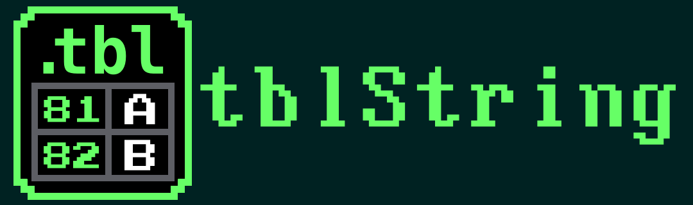

> [!CAUTION]
> While this plugin does work with one single table ("default"), it's still a PoC. Expect stuff to break and all.

Goal: make custom game text encodings usable directly inside Ghidra, without manually decoding bytes into comments.

## Concept

`ghidra-tblString` is a custom Ghidra data type that decodes bytes or words using a project-local `.tbl` registry.

Instead of treating encoded text as raw bytes like:

```text
f9 23 e1 23 ff e8 23 f0 23 e3 23
```

Ghidra should display something closer to:

```text
©BIRD<FF>IRD
```

or, once controls are known:

```text
©BIRD STUDIO
```

## Core idea

A `.tbl` file is imported into the Ghidra project and stored internally. Applied strings reference the imported table by ID, not by filesystem path.

```text
tblString instance
  table_id = credits
```

This keeps projects portable and reproducible.

## User flow

### 1. Manage tables
Open the registry window while browsing a program:

```text
Window → tbl Registry
```

Actions:

- Add `.tbl...`
- Remove
- Save as
- Reload from Source File
- Overwrite Source File
- Set as Default
- Add Entry / Remove Entry
- Edit entries directly in the table

Each table stores:

```text
id
name
entries
source_path optional
```

The left-side table list is sorted by display name. Imported tables get unique display names when a
file with the same name is imported more than once.

### 2. Apply a table string

From the Listing view:

```text
Right click selection → Data → tblString
```

The popup only appears in the Listing, only when bytes are selected, and only when the current
program has at least one `.tbl` table registered. The selected byte range is converted to a
`tblString` data instance using the registry default table.

### 3. Display decoded text

The Listing shows the decoded representation as the data value.

Examples:

```text
credits_tbl_string "©BIRD STUDIO / SHUEISHA"
menu_tbl_string    "OPTIONS"
```

Each `tblString` data instance stores the selected table id in Ghidra data settings. Changing the
registry refreshes the Code Browser display so already-applied strings re-render with the new table
content.

## Table formats

Support common `.tbl` style:

```text
E1=B
E8=I
F0=R
E3=D
1F00=
FF=<CTRL_FF>
```

Multi-byte keys are required.

Important: the decoder uses longest-match-first.

Example:

```text
1F00=
1F=<1F>
```

`1F00` must win over `1F`.

## Decoder model

```text
input bytes
→ token stream using longest-match table lookup
→ rendered string
```

Unknown sequences should not fail decoding. They should render visibly, e.g.

```text
<00><24>
```

or configurable as:

```text
??
```

## Per-instance settings

The table itself is global to the project, but each applied string can have its own settings.

Examples:

```text
credits screen:
  table_id = credits
  unit = word-le
  terminator = none

menu text:
  table_id = menu
  unit = byte
  terminator = 00
```

This uses Ghidra data instance settings rather than generating one Java class per table. The current
setting is `.tbl Table`.

## Storage

Store imported tables in the current Ghidra program, not as external file references.

Current storage uses program options:

```text
tblString.defaultTableId
tblString.tables.order
tblString.tables.{id}.tbl
tblString.tables.{id}.name
tblString.tables.{id}.sourcePath
```

The important rule:

```text
A project should decode correctly even if the original .tbl file is gone.
```

## Non-goals for V1

- No automatic text discovery
- No compression support
- No full script engine decoding
- No automatic relocation or patch generation

## Future ideas

- Preview decoded string before applying
- Batch apply over selected ranges
- Detect candidate encoded strings
- Export decoded text dump
- Patch/re-encode edited text
- Support control-code schemas
- Support tilemap-style string modes for game-specific UI/credits data

## Why this matters

Binary text data is often not ASCII and often not a normal C string. Ghidra can disassemble code, but it does not understand project-specific encodings.

`tblString` fills that gap:

```text
raw bytes → readable game text
```

inside the Listing view itself.

# Credits

- The font in the icon/logo is `Super Mario Bros. NES.ttf` by [TheWolfBunny64](https://thewolfbunny64.itch.io/super-mario-bros-nes).
